# Tarea 2

Para esta tarea he utilizado dart_frog un framework de backend para Dart. Utilice postgres como base de datos. El funcionamiento es sencillo, es un CRUD para un usuario.

## Funcionamiento

Crud del empleado:

- POST 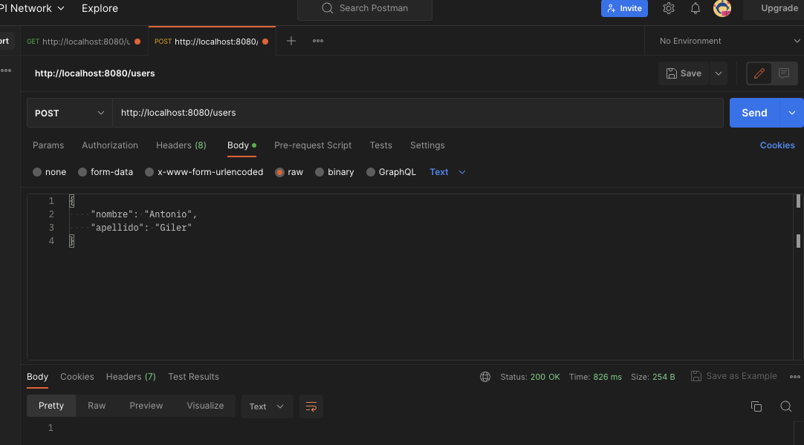
- GET 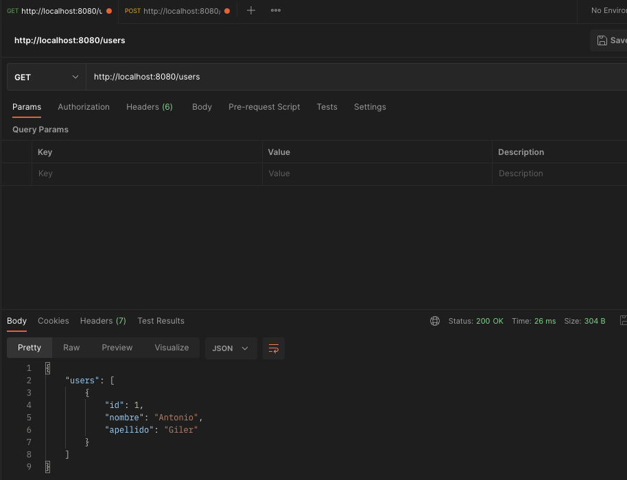
- PUT 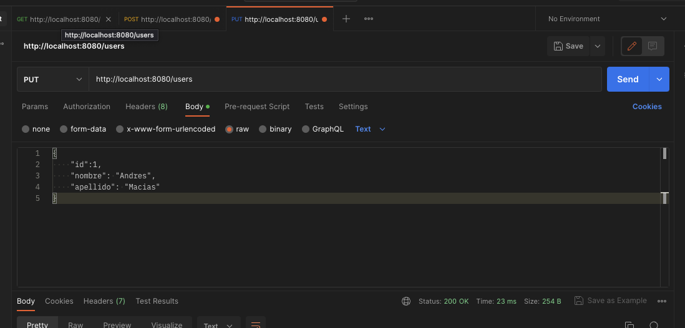
- DELETE 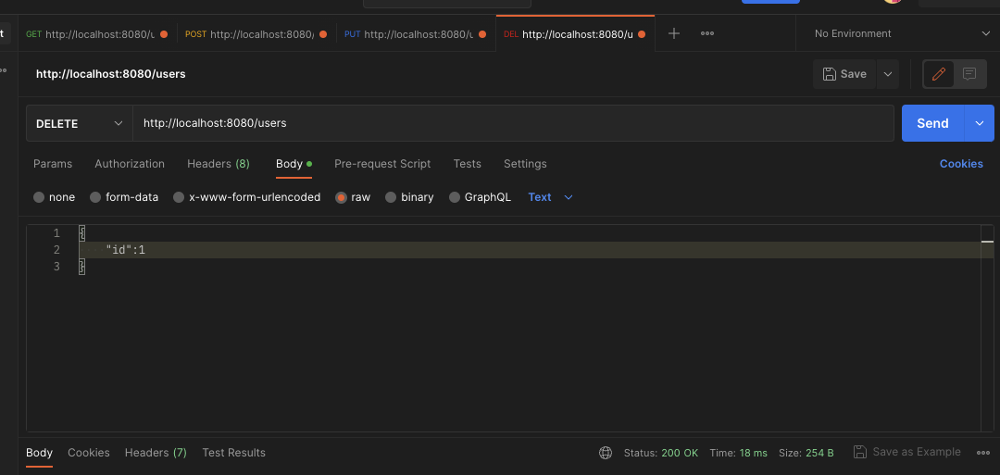

## Ejecución de comandos de forma interactiva

Para ejecutar comandos de forma interactiva nos vamos conectar al contenedor por medio de la terminal con el comando:

```bash
$ docker exec -it <container_id> bash
```

En mi caso me conectare con el siguiente comando:

```bash
$ docker exec -it 6f02128e8d59a2309ea96fcb8d0fcba61dc05ccbad382ea5389a4b07a9db7223 bash
```

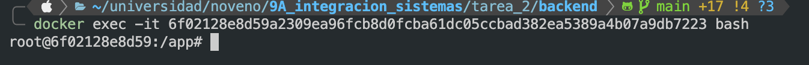

Una vez conectado ya podemos ejecutar comandos como si estuvieramos trajando en el sistema host como acostumbramos

1. `$ dart pub get ` 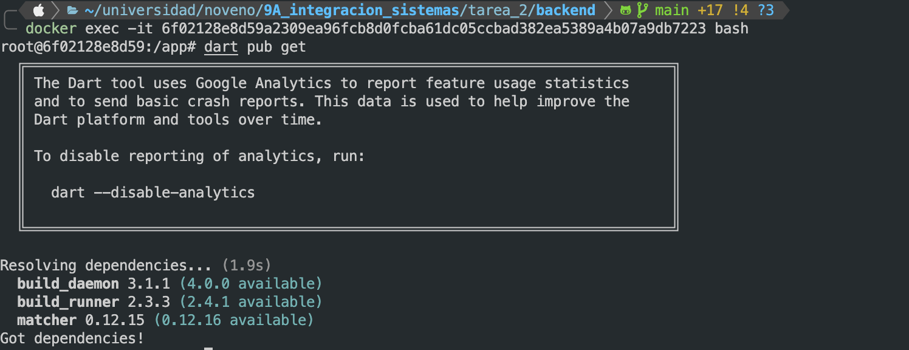
2. `$ dart run build_runner build --delete-conflicting-outputs ` 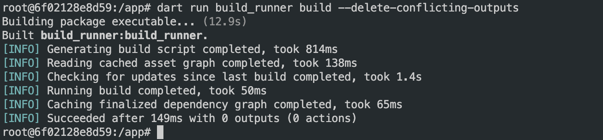
3. `$ dart pub global run dart_frog_cli:dart_frog build ` 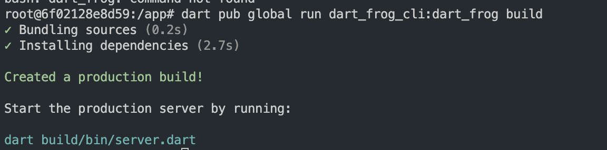
4. `$ dart pub get --offline ` 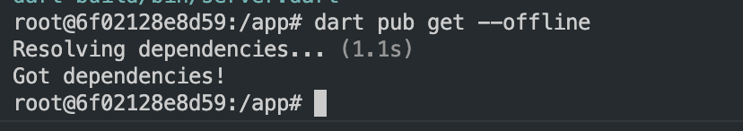
5. `$ dart compile exe build/bin/server.dart -o build/bin/server ` 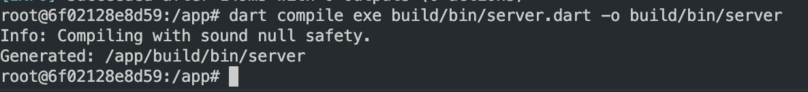

Cualquiera de los cambios que hemos realizado se ven reflejados tanto en el contenedor como en nuestro host.

## Problemas interesantes con el dockerfile

Cuando tenemos un volumen, y dentro de nuestro dockerfile queremos realizar operaciones que modifiquen el contenido del mismo, una vez terminen los pasos de para crear el contenedor (los comandos RUN), todos los cambios que hayamos realizado seran borrados.
Dentro del desarrollo probe muchas formas de poder ejecutar ciertos comandos que son necesarios para el funcionamiento del backend, por ejemplo:

- descargar librerias
- ejecutar comando para generacion de archivos
- migracion de tablas a la base de datos
- instalación de cli para framework del backend

Para que estos comandos pudieran ser ejecutados efectivamente fue necesario que se ejecutaran dentro de la instrucción CMD
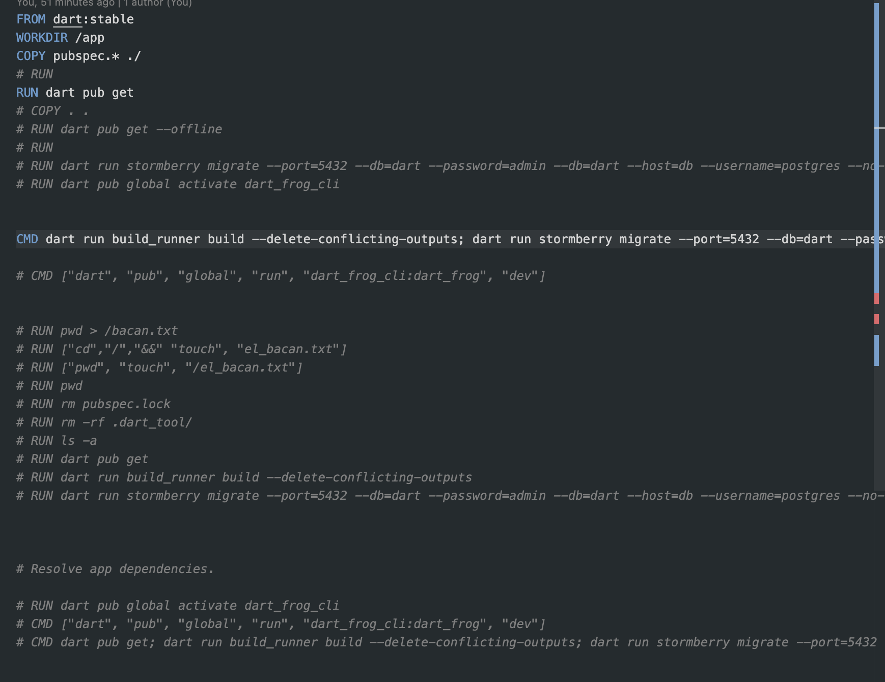

En conclusión si estamos utilizando un volumen:

1. Los archivos que vamos a montar en la carpeta de destino no estaran disponibles hasta que lleguemos a la directiva CMD
2. Podemos ejecutar comandos con run en una carpeta dentro del volumen si es que declaramos esta carpeta dentro de los volumenes del docker-compose de la siguiente forma:
   - ejemplo: se pone como volumen la carpeta para las librerias del backend 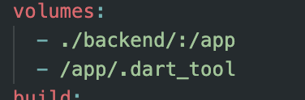
3. Los comandos que necesitemos ejecutar, por ejemplo comandos de generación de archivos, que son necesarios para el arranque de nuestro backend podremos ejecutarlos dentro de la instrucción CMD, en esta podemos ejecutar los comandos que necesitemos separandolos por un ;
   - ejemplo: CMD dart run build_runner; dart_frog dev
