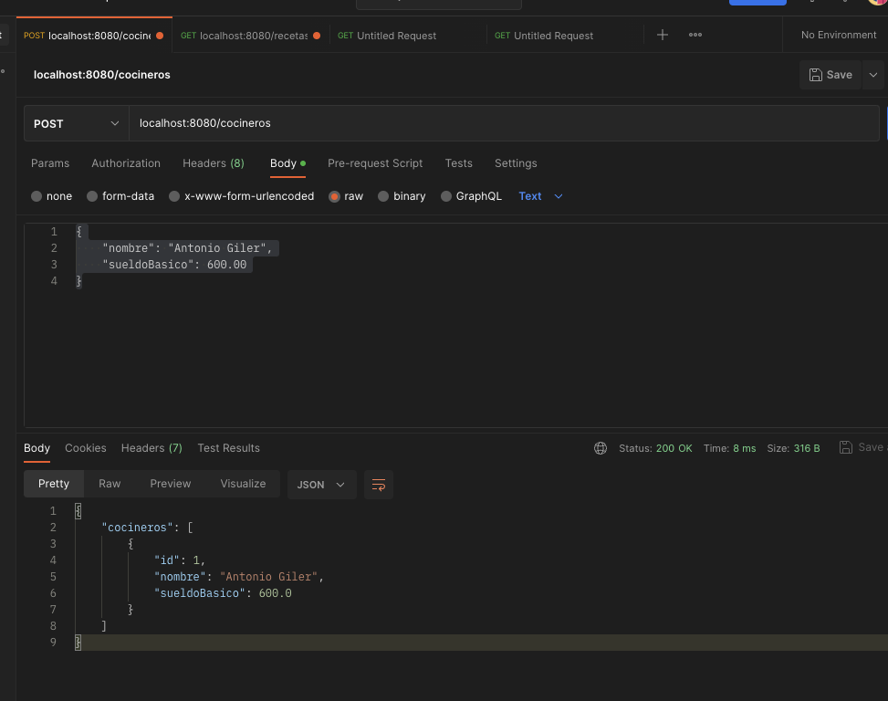
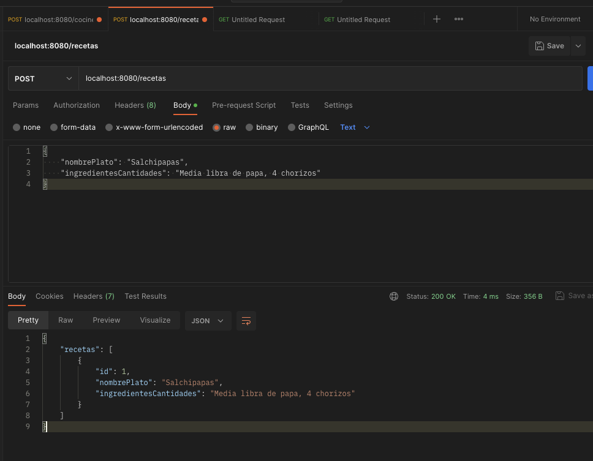
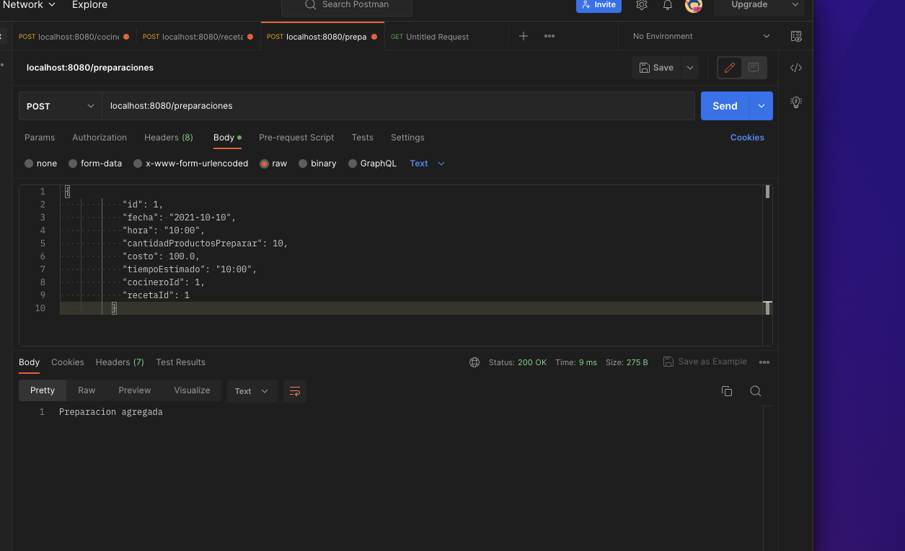
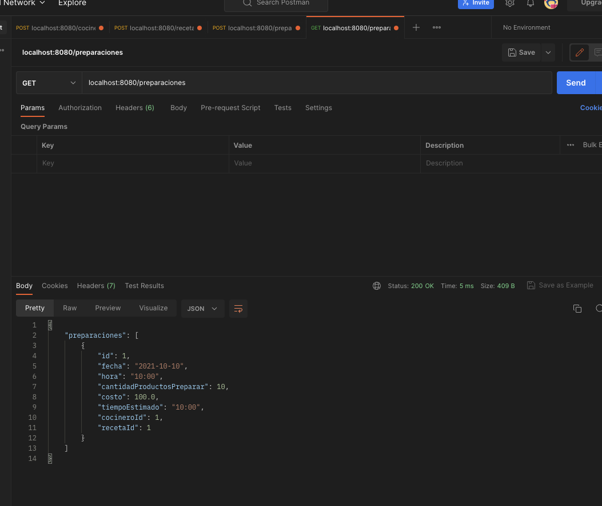
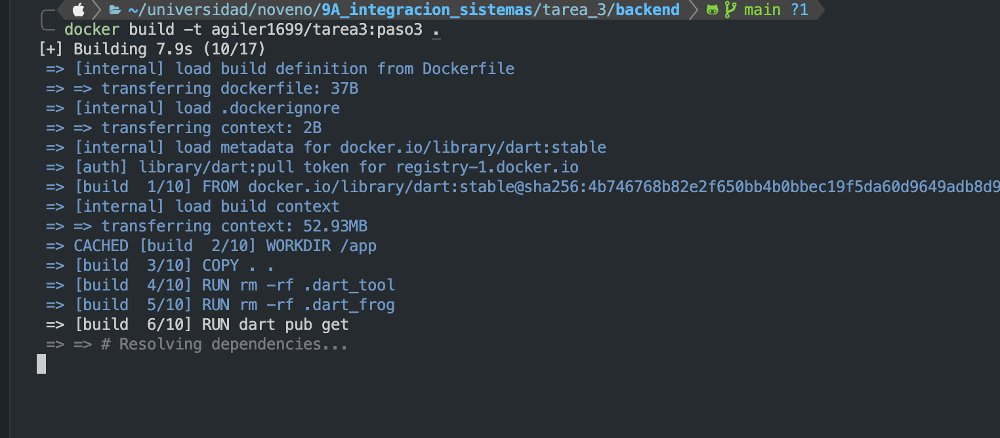
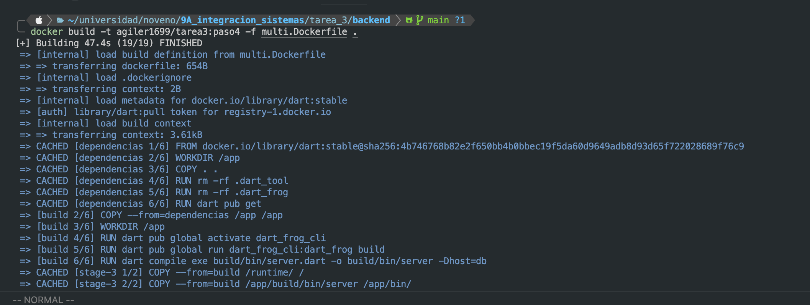
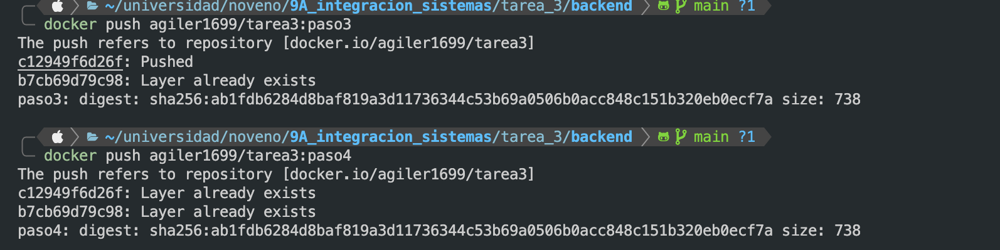
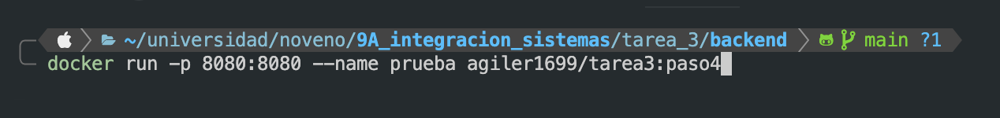

# Tarea 3

Para esta tarea he utilizado dart_frog un framework de backend para Dart. Utilice postgres como base de datos.

## Servicio REST

Creacion de cocineros:

- POST 

Creacion de recetas:

- POST 

Creacion de preparación:

- POST 

Obtener prepaciones:

- GET 

## Creación de tags

Creación de tag inicial

```bash
$ docker build -t agiler1699/tarea3:paso3 .
```

- 

Creación de tag multi stage

```bash
$ docker build -t agiler1699/tarea3:paso4 ./multi.Dockerfile -f
```

- 

## Subir imagenes a dockerhub



## Probar imagenes de docker hub


